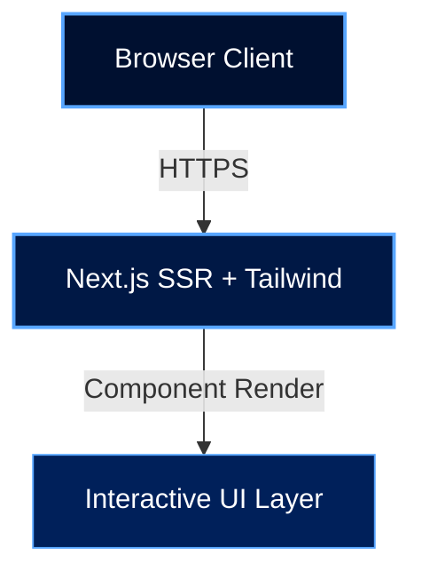

<div align="center">

![Header](data:image/svg+xml;base64,PHN2ZyB3aWR0aD0iODAwIiBoZWlnaHQ9IjIwMCIgdmlld0JveD0iMCAwIDgwMCAyMDAiIHhtbG5zPSJodHRwOi8vd3d3LnczLm9yZy8yMDAwL3N2ZyI+CiAgPGRlZnM+CiAgICA8bGluZWFyR3JhZGllbnQgaWQ9ImJnIiB4MT0iMCUiIHkxPSIwJSIgeDI9IjEwMCUiIHkyPSIxMDAlIj4KICAgICAgPHN0b3Agb2Zmc2V0PSIwJSIgc3RvcC1jb2xvcj0iIzAwMTAzMCIvPgogICAgICA8c3RvcCBvZmZzZXQ9IjUwJSIgc3RvcC1jb2xvcj0iIzAwMTg0NSIvPgogICAgICA8c3RvcCBvZmZzZXQ9IjEwMCUiIHN0b3AtY29sb3I9IiMwMDIwNWEiLz4KICAgIDwvbGluZWFyR3JhZGllbnQ+CiAgICA8ZmlsdGVyIGlkPSJnbG93Ij4KICAgICAgPGZlR2F1c3NpYW5CbHVyIHN0ZERldmlhdGlvbj0iNCIgcmVzdWx0PSJiIi8+CiAgICAgIDxmZUNvbXBvc2l0ZSBpbj0iU291cmNlR3JhcGhpYyIgaW4yPSJiIiBvcGVyYXRvcj0ib3ZlciIvPgogICAgPC9maWx0ZXI+CiAgICA8ZmlsdGVyIGlkPSJnbG93MiI+CiAgICAgIDxmZUdhdXNzaWFuQmx1ciBzdGREZXZpYXRpb249IjgiIHJlc3VsdD0iYiIvPgogICAgICA8ZmVDb21wb3NpdGUgaW49IlNvdXJjZUdyYXBoaWMiIGluMj0iYiIgb3BlcmF0b3I9Im92ZXIiLz4KICAgIDwvZmlsdGVyPgogIDwvZGVmcz4KICA8cmVjdCB3aWR0aD0iMTAwJSIgaGVpZ2h0PSIxMDAlIiBmaWxsPSJ1cmwoI2JnKSIgcng9IjEyIi8+CiAgCiAgPCEtLSBHcmlkIGxpbmVzIC0tPgogIDxsaW5lIHgxPSIwIiB5MT0iNTAiIHgyPSI4MDAiIHkyPSI1MCIgc3Ryb2tlPSIjNThhNmZmIiBvcGFjaXR5PSIwLjA1IiBzdHJva2Utd2lkdGg9IjEiLz4KICA8bGluZSB4MT0iMCIgeTE9IjEwMCIgeDI9IjgwMCIgeTI9IjEwMCIgc3Ryb2tlPSIjNThhNmZmIiBvcGFjaXR5PSIwLjA1IiBzdHJva2Utd2lkdGg9IjEiLz4KICA8bGluZSB4MT0iMCIgeTE9IjE1MCIgeDI9IjgwMCIgeTI9IjE1MCIgc3Ryb2tlPSIjNThhNmZmIiBvcGFjaXR5PSIwLjA1IiBzdHJva2Utd2lkdGg9IjEiLz4KICA8bGluZSB4MT0iMjAwIiB5MT0iMCIgeDI9IjIwMCIgeTI9IjIwMCIgc3Ryb2tlPSIjNThhNmZmIiBvcGFjaXR5PSIwLjA1IiBzdHJva2Utd2lkdGg9IjEiLz4KICA8bGluZSB4MT0iNDAwIiB5MT0iMCIgeDI9IjQwMCIgeTI9IjIwMCIgc3Ryb2tlPSIjNThhNmZmIiBvcGFjaXR5PSIwLjA1IiBzdHJva2Utd2lkdGg9IjEiLz4KICA8bGluZSB4MT0iNjAwIiB5MT0iMCIgeDI9IjYwMCIgeTI9IjIwMCIgc3Ryb2tlPSIjNThhNmZmIiBvcGFjaXR5PSIwLjA1IiBzdHJva2Utd2lkdGg9IjEiLz4KICAKICAKICA8Y2lyY2xlIGN4PSI0MjAiIGN5PSIzMCIgcj0iMiIgZmlsbD0iIzU4YTZmZiIgb3BhY2l0eT0iMC42Ij4KICAgIDxhbmltYXRlIGF0dHJpYnV0ZU5hbWU9ImN4IiB2YWx1ZXM9IjQyMDsgMzgwOyA0MjAiIGR1cj0iNHMiIHJlcGVhdENvdW50PSJpbmRlZmluaXRlIiAvPgogICAgPGFuaW1hdGUgYXR0cmlidXRlTmFtZT0ib3BhY2l0eSIgdmFsdWVzPSIwLjM7IDAuOTsgMC4zIiBkdXI9IjVzIiByZXBlYXRDb3VudD0iaW5kZWZpbml0ZSIgLz4KICA8L2NpcmNsZT4KICA8Y2lyY2xlIGN4PSI0NjAiIGN5PSI1NSIgcj0iMyIgZmlsbD0iIzU4YTZmZiIgb3BhY2l0eT0iMC42Ij4KICAgIDxhbmltYXRlIGF0dHJpYnV0ZU5hbWU9ImN4IiB2YWx1ZXM9IjQ2MDsgMzQwOyA0NjAiIGR1cj0iNnMiIHJlcGVhdENvdW50PSJpbmRlZmluaXRlIiAvPgogICAgPGFuaW1hdGUgYXR0cmlidXRlTmFtZT0ib3BhY2l0eSIgdmFsdWVzPSIwLjM7IDAuOTsgMC4zIiBkdXI9IjdzIiByZXBlYXRDb3VudD0iaW5kZWZpbml0ZSIgLz4KICA8L2NpcmNsZT4KICA8Y2lyY2xlIGN4PSIyNjAiIGN5PSI4MCIgcj0iNCIgZmlsbD0iIzU4YTZmZiIgb3BhY2l0eT0iMC42Ij4KICAgIDxhbmltYXRlIGF0dHJpYnV0ZU5hbWU9ImN4IiB2YWx1ZXM9IjI2MDsgNTQwOyAyNjAiIGR1cj0iNXMiIHJlcGVhdENvdW50PSJpbmRlZmluaXRlIiAvPgogICAgPGFuaW1hdGUgYXR0cmlidXRlTmFtZT0ib3BhY2l0eSIgdmFsdWVzPSIwLjM7IDAuOTsgMC4zIiBkdXI9IjZzIiByZXBlYXRDb3VudD0iaW5kZWZpbml0ZSIgLz4KICA8L2NpcmNsZT4KICA8Y2lyY2xlIGN4PSI3MDAiIGN5PSIxMDUiIHI9IjIiIGZpbGw9IiM1OGE2ZmYiIG9wYWNpdHk9IjAuNiI+CiAgICA8YW5pbWF0ZSBhdHRyaWJ1dGVOYW1lPSJjeCIgdmFsdWVzPSI3MDA7IDEwMDsgNzAwIiBkdXI9IjZzIiByZXBlYXRDb3VudD0iaW5kZWZpbml0ZSIgLz4KICAgIDxhbmltYXRlIGF0dHJpYnV0ZU5hbWU9Im9wYWNpdHkiIHZhbHVlcz0iMC4zOyAwLjk7IDAuMyIgZHVyPSI3cyIgcmVwZWF0Q291bnQ9ImluZGVmaW5pdGUiIC8+CiAgPC9jaXJjbGU+CiAgPGNpcmNsZSBjeD0iMTQwIiBjeT0iMTMwIiByPSIzIiBmaWxsPSIjNThhNmZmIiBvcGFjaXR5PSIwLjYiPgogICAgPGFuaW1hdGUgYXR0cmlidXRlTmFtZT0iY3giIHZhbHVlcz0iMTQwOyA2NjA7IDE0MCIgZHVyPSI0cyIgcmVwZWF0Q291bnQ9ImluZGVmaW5pdGUiIC8+CiAgICA8YW5pbWF0ZSBhdHRyaWJ1dGVOYW1lPSJvcGFjaXR5IiB2YWx1ZXM9IjAuMzsgMC45OyAwLjMiIGR1cj0iNXMiIHJlcGVhdENvdW50PSJpbmRlZmluaXRlIiAvPgogIDwvY2lyY2xlPgogIDxjaXJjbGUgY3g9IjU4MCIgY3k9IjE1NSIgcj0iNCIgZmlsbD0iIzU4YTZmZiIgb3BhY2l0eT0iMC42Ij4KICAgIDxhbmltYXRlIGF0dHJpYnV0ZU5hbWU9ImN4IiB2YWx1ZXM9IjU4MDsgMjIwOyA1ODAiIGR1cj0iNXMiIHJlcGVhdENvdW50PSJpbmRlZmluaXRlIiAvPgogICAgPGFuaW1hdGUgYXR0cmlidXRlTmFtZT0ib3BhY2l0eSIgdmFsdWVzPSIwLjM7IDAuOTsgMC4zIiBkdXI9IjZzIiByZXBlYXRDb3VudD0iaW5kZWZpbml0ZSIgLz4KICA8L2NpcmNsZT4KICAKICA8IS0tIFNjYW5uaW5nIGxpbmUgLS0+CiAgPHJlY3QgeD0iMCIgeT0iMCIgd2lkdGg9IjgwMCIgaGVpZ2h0PSIzIiBmaWxsPSIjNThhNmZmIiBvcGFjaXR5PSIwLjMiPgogICAgPGFuaW1hdGUgYXR0cmlidXRlTmFtZT0ieSIgdmFsdWVzPSIwOyAyMDA7IDAiIGR1cj0iNnMiIHJlcGVhdENvdW50PSJpbmRlZmluaXRlIi8+CiAgPC9yZWN0PgogIAogIDx0ZXh0IHg9IjUwJSIgeT0iNDIlIiBmb250LWZhbWlseT0iQXJpYWwsc2Fucy1zZXJpZiIgZm9udC13ZWlnaHQ9ImJvbGQiIGZvbnQtc2l6ZT0iMzgiIGZpbGw9IiM1OGE2ZmYiIHRleHQtYW5jaG9yPSJtaWRkbGUiIGZpbHRlcj0idXJsKCNnbG93KSIgc3R5bGU9ImxldHRlci1zcGFjaW5nOjRweCI+CiAgICBBSSBEUklWRU4gRSBHT1ZFUk5BTkNFIFNFUgogIDwvdGV4dD4KICA8dGV4dCB4PSI1MCUiIHk9IjYyJSIgZm9udC1mYW1pbHk9IkFyaWFsLHNhbnMtc2VyaWYiIGZvbnQtc2l6ZT0iMTMiIGZpbGw9IiM4MmIxZmYiIHRleHQtYW5jaG9yPSJtaWRkbGUiIHN0eWxlPSJsZXR0ZXItc3BhY2luZzozcHg7b3BhY2l0eTowLjgiPgogICAgUFJPUFJJRVRBUlkgVFlQRVNDUklQVCBBUkNISVRFQ1RVUkUKICA8L3RleHQ+CiAgCiAgPCEtLSBCb3R0b20gYWNjZW50IGxpbmUgLS0+CiAgPGxpbmUgeDE9IjI1MCIgeTE9IjE3NSIgeDI9IjU1MCIgeTI9IjE3NSIgc3Ryb2tlPSIjNThhNmZmIiBzdHJva2Utd2lkdGg9IjIiIGZpbHRlcj0idXJsKCNnbG93KSI+CiAgICA8YW5pbWF0ZSBhdHRyaWJ1dGVOYW1lPSJ4MSIgdmFsdWVzPSIyNTA7MzAwOzI1MCIgZHVyPSIzcyIgcmVwZWF0Q291bnQ9ImluZGVmaW5pdGUiLz4KICAgIDxhbmltYXRlIGF0dHJpYnV0ZU5hbWU9IngyIiB2YWx1ZXM9IjU1MDs1MDA7NTUwIiBkdXI9IjNzIiByZXBlYXRDb3VudD0iaW5kZWZpbml0ZSIvPgogIDwvbGluZT4KPC9zdmc+)

<br/>

<p align="center">
  
  
  
  
</p>

  
  
  
  

<br/>


</div>

---

## Overview

> Automated grievance redressal system using NLP for classification.

**AI Driven E Governance Services Hosted on Secure Cloud** is an advanced web application system engineered by **Karthik Idikuda**. Built with TypeScript, React, Next.js, TailwindCSS.

<br/>

## System Architecture



<br/>

## Project Structure

```
AI-Driven-E-Governance-Services-Hosted-on-Secure-Cloud/
  .env.example
  .gitignore
  LICENSE
  README.md
  next.config.js
  package-lock.json
  package.json
  postcss.config.js
  .github/
    copilot-instructions.md
  docs/
    FREE_SERVICES.md
  src/
```

<br/>

## Technical Specifications

| Attribute | Detail |
|:---|:---|
| **Primary Language** | `TypeScript` |
| **Project Category** | `Web Application` |
| **Total Source Files** | `32` |
| **Frameworks** | `TypeScript`, `React`, `Next.js`, `TailwindCSS` |
| **IP Status** | `Strictly Proprietary` |

## Dependencies

<p align="left">
  <code>eslint-config-next</code>  <code>@azure/msal-react</code>  <code>@azure/storage-blob</code>  <code>class-variance-authority</code>  <code>next</code>  <code>@types/react-dom</code>  <code>openai</code>  <code>@azure/cosmos</code>  <code>react</code>  <code>eslint</code>  <code>tailwind-merge</code>  <code>react-dom</code>  <code>postcss</code>  <code>lucide-react</code>  <code>@azure/openai</code>
</p>


## STRICT LEGAL WARNING

> **PROPRIETARY AND CONFIDENTIAL**

This software is the **exclusive property of Karthik Idikuda**.

- **NO PERMISSION** to use, copy, modify, or distribute without written consent.
- **UNAUTHORIZED USE** results in litigation, financial penalties, and criminal prosecution.
- **LICENSING:** Contact Karthik Idikuda directly to negotiate terms.

*By viewing this repository, you accept these proprietary terms.*

---

<div align="center">
  <br/>
  
</div>

<!-- WATERMARK: S0ktUFJPUFJJRVRBUlktQUktRHJpdmVuLUUtR292ZXJuYW5jZS1TZXJ2aWNlcy1Ib3N0ZWQtb24tU2VjdXJlLUNsb3VkLTIwMjY= -->
